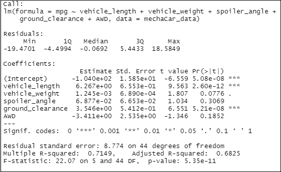
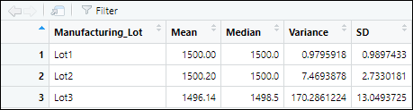
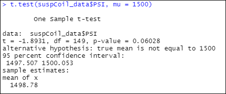
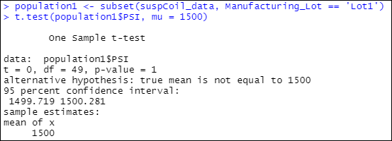
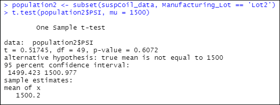
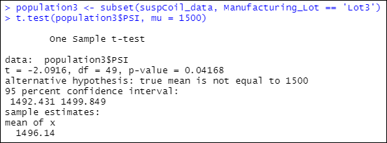

# MechaCar
Statistical Analysis using R &amp; RStudio

## Project Overview

## Resources
- Data Source: [MechaCar MPG](Data/MechaCar_mpg.csv), [Suspension Coil Data](Data/Suspension_Coil.csv)
- Software/Applications: RStudio Version 1.4.11
- Libraries: tidyverse, dplyr

## Linear Regression to Predict MPG

  

  

- The PSI variance of 76.23 for all Lots does not exceed the design specification of 100 pound per square inch.

#### 2. Manufacturing Lot Summary

  

- Lot 1 has a PSI variance of **0.98** which does not exceed the design specification of 100 pounds per square inch.
- Lot 2 has a PSI variance of **7.47** which does not exceed the design specification of 100 pounds per square inch.
- Lot 3 has a PSI variance of **170.29** which exceeds the design specification of 100 pounds per square inch. 

## T-Tests on Suspension Coils

#### All Manufacturing Lots

- The p-value (0.06028) is greater than the assumed significance level of 0.05%.  Therefore, the two means are statistically similar and we would fail to reject the null hypothesis

  

#### Lot 1 

- The p-value (1) is greater than the assumed significance level of 0.05%. Therefore, the two means are statistically similar and we would fail to reject the null hypothesis.

  

#### Lot 2

- The p-value (0.6072) is greater than the assumed significance level of 0.05%. Therefore, the two means are statistically similar and we would fail to reject the null hypothesis.

  

#### Lot 3

- The p-value (0.04168) is greater than the assumed significance level of 0.05%. Therefore, the two means are statistically different and there is sufficient evidence to reject the null hypothesis.

  

## Study Design: MechaCar vs Competition

- What metric or metrics are you going to test?
- What is the null hypothesis or alternative hypothesis?
- What statistical test would you use to test the hypothesis? And why? 
- What data is needed to run the statistical test?